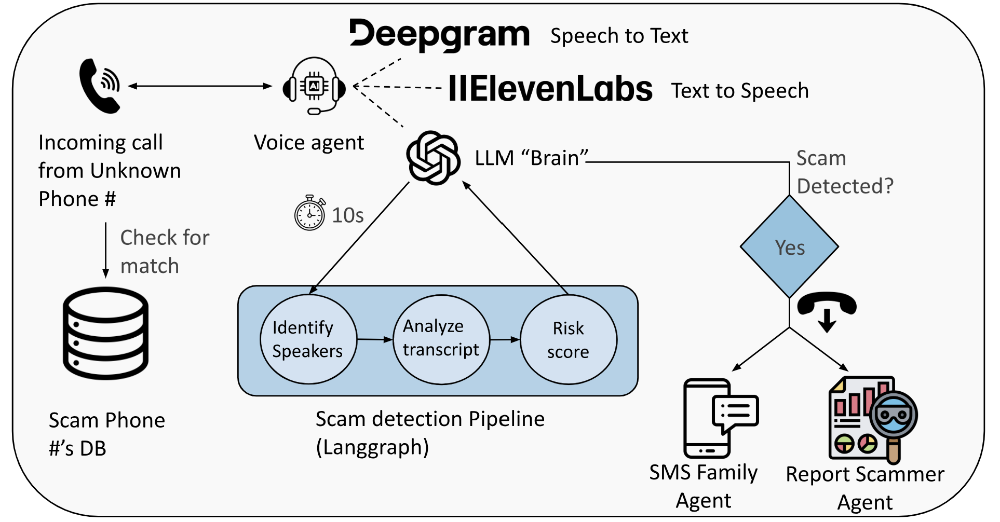

# Guardian Agent
This is the repo for the Junction 2025 hackathon in Espoo team TiramAIsu (Marom Sverdlov and Oliver Erven). We fully build the entire codebase in around 24 hours of work. 

## Motivation
Our parents and grandparents are getting older, and the world around them is getting more complicated.  
Phone scams are no longer clumsy attempts from strangers with broken English. AI has given scammers polished voices, convincing scripts, and the ability to sound like trusted companies or even family members. 

Last year alone, millions of people were targeted by phone scams worldwide, with billions of euros lost, and the numbers are rising fast.  
It’s easy to think that it could never happen to you or your family, but that's exactly what everybody who got scammed thought as well.

We built Guardian Agent because we wanted something real, something that actually steps in *during* the call, not after the damage is done.  
Not another article warning “watch out for scams” but a system that listens, understands, and acts when it matters.

Guardian Agent is an all-encompassing safety layer. 
An AI guardian that silently monitors phone calls from unknown numbers, detects scam signals, and only speaks when someone you love might be in danger.  
It can stop scams in real time, step in to question suspicious callers, automatically hang up when a scam is detected, notify family members, and even report the number to help prevent the same scam from happening to someone else in the future.


## Features
- **Live call monitoring** through a real-time voice agent that listens quietly in the background  
- **Advanced scam detection** using phone-number reputation checks, linguistic analysis, behavioral cues, and intent modeling  
- **Real-time intervention**  
  - Asks legitimacy-checking questions when something feels suspicious  
  - Issues strong warnings when danger is confirmed  
  - Can automatically **hang up** on the scammer to protect the user  
- **Family safety alerts**, instantly sends SMS notifications to family members if a high-risk call occurs
- **Automatic scam reporting** to help stop the same number from targeting other victims in the future. 
- **Demo frontend** for visualizing ongoing calls, risk levels, transcripts, and agent decisions (E2E encrypted by default; intended for demonstration and debugging).

## Architecture Overview
<p align="center">
  
</p>
When a call comes in from an unknown number, Guardian Agent first checks it against our scam-number database. If it’s already flagged, the system immediately treats the call as a scam and handles it automatically. If not, Guardian Agent switches into real-time monitoring mode and begins to observe. Using Deepgram for speech-to-text, ElevenLabs for text-to-speech, and an OpenAI-powered reasoning layer to analyze the conversation, the pipeline reviews the conversation transcript and calculates a risk score every 10 seconds. If that score reaches the 70–85% range, the agent can step in and challenge the caller with targeted questions to gather more evidence. When the risk exceeds 85%, Guardian Agent concludes the call is a scam: it alerts the user continuously until they hang up, sends an SMS to designated family members and reports the number on the offical scam reporting website to protect others in the future.

## Demo
[Demo Video](https://www.youtube.com/watch?v=aAmqraH199g)

## Getting Started

### Prerequisites
To run the Guardian Agent, you’ll need accounts/tokens for:
- **LiveKit Cloud** (SIP + Realtime Audio)
- **OpenAI API** (LLM)
- **ElevenLabs API** (TTS)
- **Twilio API** (Calling and SMS) 
- Python 3.10+  

You will also need to purchase a number from Twilio:  
[Twilio Phone Numbers](https://www.twilio.com/en-us/phone-numbers) and connect your SIP provider to [LiveKit](https://livekit.io/) for incoming calls.

### Installation
#### Backend
```bash
git clone https://github.com/your-org/tiramaisu.git
cd tiramaisu
python -m venv .venv
source .venv/bin/activate  # or .venv\Scripts\activate on Windows
pip install -r requirements.txt
pip install "livekit-agents[deepgram openai,cartesia,silero,elevenlabs,turn-detector]~=1.0" "livekit-plugins-noise-cancellation~=0.2" "python-dotenv"
```

#### Frontend
```bash
cd Frontend
npm install
```

### Environment Setup
Create a `.env` file in the root directory, copy paste the fields from `.env.example` and fill them all in.

## Running the System

To run Guardian Agent end-to-end, you must start **three processes**:

1. **Guardian Voice Agent** (handles live calls + scam detection)  
2. **Backend Server (FastAPI)** (`app.py`)  
3. **Frontend Dashboard** (optional demo UI)

Run each of the following **in a separate terminal** from the root directory.


```bash
#Backend
python Backend/app.py
python Backend/telephony_agent.py start 

#Frontend
cd Frontend
npm run dev
```

If you want to automatically add the Guardian Agent to incomming unknown phone calls, configure this using [Bixby Routines](https://www.samsung.com/uk/support/mobile-devices/how-to-use-bixby-routines/) on Android or similair software on Apple.

Now when an unknown phone number calls you, Guardian Agent will join the call and watch over you.


## Roadmap/ Future improvements

- **Advanced LLM fine-tuning for scam detection:**  
  Further train domain-specific models to improve accuracy, consistency, and sensitivity to emerging scam patterns.

- **Additional ML-based detection techniques:**  
  Incorporate classical machine-learning and anomaly-detection methods to complement LLM reasoning and strengthen multi-signal risk scoring.

- **Real-time caller intelligence:**  
  Add the ability to research the caller during the call—gathering public information, reputation data, and past reports to enrich context.

